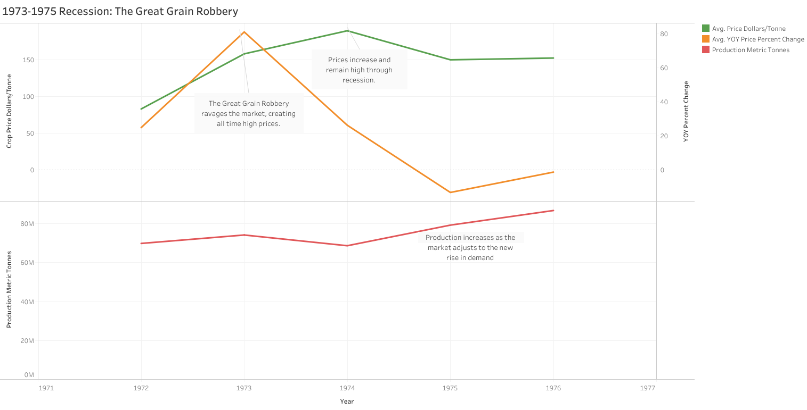

# **20th Century Agriculture: An Historical Analysis**

**By Joshua Mills**

[LinkedIn](https://www.linkedin.com/in/josh-mills-258465336](https://www.linkedin.com/in/josh-mills-258465336))

Data Source: \[ [https://www.kaggle.com/datasets/aradhanahirapara/farm-produce-data-80-years](https://www.kaggle.com/datasets/aradhanahirapara/farm-produce-data-80-years) \]  
Tools used: MySQL for cleaning and analysis, Tableau for visualization
[Visualizations on Tableau](https://public.tableau.com/app/profile/joshua.mills7659/viz/FarmDataCaseStudy/Outliers#1)

## Table of Contents
1. [Data Ingestion and Cleaning](#data-ingestion-and-cleaning)
2. [Analysis: A Timeline of Volatility](#analysis-a-timeline-of-volatility)
    - [Introduction - Price Vs. Production: An Overview of General Trends](*introduction-price-vs.-production-an-overview-of-general-trends)
    - [1910 - Flaxseed](#1910---flaxseed)
    - [WW1: Agriculture Boom (1914-1918)](#ww1-agriculture-boom1914-1918)
    - [1920-21 Recession (1920-21)](#1920-21-recession1920-21)
    - [The Great Depression and The Dust Bowl (1929-1939)](#the-great-depression-and-the-dust-bowl1929-1939)
    - [World War 2: Wartime Boom (1939-1945)](#world-war-2-wartime-boom1939-1945)
    - [Post War Expansion (1945-1972)](#post-war-expansion1945-1972)
    - [Post Expansion Recession, and Onward (1973-1984)](#post-expansion-recession-and-onward1973-1984)
    - [Mechanization](#mechanization)
4. [Zero Seeded Area - A Deep Dive on Unplanted Crops](#zero-seeded-area---a-deep-dive-on-unplanted-crops)
   - [Corn](#corn)
   - [Barley, Oats, and Wheat](barley-oats-and-wheat)
   - [Sugar Beets](#sugar-beets)
   - [Rye](#rye)
   - [Peas](#peas)
   - [Sunflower Seed](#sunflower-seed)
   - [Canola](#canola)
   - [Flaxseed](#flaxseed)
   - [Mustard Seed](#mustard-seed)
6. [Outro](#outro)

# **Data Ingestion and Cleaning**

The data ingestion and cleaning proved to be a particularly interesting case. Despite being labeled as clean, detailed, and usable, I found three glaring issues, and a handful of smaller ones.

## **Duplicate Data**

The first issue that I solved was some duplicated data surrounding the year 1954/1955. During my cleaning and exploration I found that the year 1954 had twice the crop data as the years surrounding it, and I'd found that the year 1955 was missing from the data. Through observation of the years surrounding, I determined that the most likely scenario is that the year was misentered for the 1955 data. All of the duplicated records were unique on all columns but ref\_date,type\_of\_crop, and region. All of the records are also in chronological order, so I reasoned that every second record for 1954 for each crop type was supposed to be 1955\. I added an auto-incremented ID column to the table, as the updates would not work without it. Using ROW\_NUMBER() I isolated each second record for each type of crop, and implemented a targeted update statement to change the ref date of those records to 1955\.

## **Summary Records**

The second, and far larger issue that I found was aggregate records. There are multiple groups of records combining data from the base set within the base set data itself. For example, records with the region CA(Canada) was an aggregate of all regions put together. This wasn’t a separate column, but around 1200 individual records. I found the same combining Prairie Provinces(PP), and Maritime Provinces(MP), both of which combined their respective provinces.

This isn’t the only place I found summary records. In the crop types there are individual records for spring, winter, and durum. Then there is a summary record for each year and each region that combines them under wheat, all. However, “Wheat, all” appears to have the correct data in this case.The majority of wheat, spring does not have accurate data. For instance, spring wheat in 1978 is listed as 18500 metric tonnes, whereas spring wheat in 1979 is over 14 million metric tonnes. Low, unrealistic numbers go back the entire way through the data set for spring wheat.

I correlated this claim with this publication, which quotes under the section **Grain Marketing and Quality 1978-79 “Western Canadian producers marketed 13.1 million tonnes of red spring wheat during the crop year, a decrease of 24% from the 17.3 million-tonne level in the previous crop year.”** While it does not have the entire matching number for the entirety of Canada, it substantiates the data far more than the non-aggregate records in this case. The trends going through the data for “Wheat, all” line up with my historical research compared to the individual records. \[ [https://publications.gc.ca/collections/collection\_2025/ccg-cgc/A91-1-4-1979-eng.pdf](https://publications.gc.ca/collections/collection_2025/ccg-cgc/A91-1-4-1979-eng.pdf) \]

Rye was essentially the same situation. There was a summary record series that was more full and accurate than the individual growing season records, which did not encompass the full data period.

## **Data Misentry:**

The last major data integrity issue I found revolves around what I found to most likely be a data entry mistake. After I calculated the outliers, which the bulk of this analysis revolves around, I found that the year 1953 had an increase of upwards of 800% for three crops. This is dollars/tonne of production. These were sugar beets, corn for silage, and tame hay. I compared the data from 1952-1953, both separately and aggregated. The average price goes from $0.54 to $4.52 for corn, $1.65 to $14.6 for sugar beets, and $1.61 to $15.1 for tame hay. The data before the jump all fall within single digit dollar range, and after the jump the data remains in the double digits. My initial thought was that this was a data entry issue placing the decimal one to the right starting in 1953 and persisting throughout the remaining records. However, I found a report from a CA government website which showed me that the values in records for all years preceding 1953 to be 1/10 of the values at the time. To rectify this, I used a targeted update statement for years \<=1952 and those three crops, multiplying the avg\_price\_dollars\_per\_tonne by 10\. After this update I re-ran my outlier detection script. This uncovered previously hidden outliers due to the deflated data. \[ [https://www66.statcan.gc.ca/eng/1919/191902070170\_p.%20170.pdf\#:\~:text=The%20values%20of%20grain%20are%20based%20upon,the%20corresponding%20values%20for%201918%20being%20given](https://www66.statcan.gc.ca/eng/1919/191902070170_p.%20170.pdf#:~:text=The%20values%20of%20grain%20are%20based%20upon,the%20corresponding%20values%20for%201918%20being%20given) \]

This is not all of the data cleaning that I did, but those were the most glaring issues.  
[Click here for full data cleaning notes](SQL_Queries/Data_Cleaning/data_ingestion_and_cleaning.sql)

**In the end, I had 7074 usable records, from 10273 on upload.**

For my analysis, the main metrics I used were ref\_date(year), region, type\_of\_crop, avg\_farm\_price\_dollars\_per\_tonne, and production\_metric\_tonnes.

**To put the price column into context. Farm price is what the farmers would be paid for their crops before it is processed and distributed to the consumer market.**

---

# **Analysis: A Timeline of Volatility**

## **Introduction - Trends of Price Vs. Production: An Overview of General Trendlines**

The general trends in this data are to be expected for something like agriculture, especially during the period this data comes from: 1908-1984 from Canada specifically. Price and production have been on an upward trend over the course of the data period. There are notable spikes and crashes in either price or production along this broad overview of the data. Some spikes in price are from lack of supply, some crashes are from oversupply. That is the nature of the market.

The more interesting aspect of this data is the timeline of events that correlates with those peaks and valleys. My goal for this analysis was to dig deeper than general trend lines. There’s a story to be told, some of which I suspected from the beginning, and some I had no idea about until I started researching. There were definitely supply/demand loops that I found in the data that didn’t have any specific event tied to them, but the meat of this analysis lies within the outliers.

This analysis of nearly 80 years of Canadian farm data reveals a timeline of volatility driven largely by global events, economic cycles, and government policy. In my research, I’ve directly correlated many of these price and production outliers to both **World Wars**, **The Great Depression**, and multiple recessions including **The Great Grain Robbery of 1973**. **The data illustrates through the numbers, classic supply and demand loops as farmers chased high value crops creating price craters from oversupply,** while certain **other price outliers can be attributed to** **government policy and intervention**, like the creation of the **Canadian Wheat Board**, and the **Wheat Acreage Reduction Program**.

---
## **1910 \- Flaxseed:**

This won’t be the only time we see flaxseed in the outliers, but the first time we do is in **1910**. It is a fascinating, and relatively uncommon example of raising price ***and*** raising production in the same outlier year. 

* **\+63.5% price, \+91% production**

I could not find any event or general consensus of why this may have been, but looking at the data for the year before and after shows **47.8% increase** in production between **1908 and 1909**. In **1911** the production of flaxseed **increased** a staggering **265.34%**, subsequently **increased again in 1912 by 69%**, then dropped over the next 3 years.

**My takeaway from this, not having found any specific tied event or consensus, is that it is likely just supply and demand at play. I hypothesize there was potentially an underproduction in years prior to the dataset timeframe, leading to prices increasing, or an increase in demand that production wasn’t prepared for. Then, as prices increased, farmers continuously chased the valuable crop, causing an explosion of production. As they did, prices regulated themselves over the next 3 years until the first World War.**

---

## **WW1: Agriculture Boom(1914-1918):**

The first period of outliers within this data correlates with the agricultural boom that occurred during **World War 1**.

During **1916-1917**, due to the increased demand and lack of supply due to the war, key food crops were driven significantly higher in **price**.

* 1916 \- Corn for grain, beans, barley, wheat, and rye: **\+39-58%**  
* 1917 \- Corn for grain, beans, mixed grains, wheat, and peas: **\+38-55%**

Attributable to the same reasons, we see a similar event in **1918\.**

*  Sugar beets and tame hay: \+**52%**

In **1917**, we have our second example of a high outlier in both price and production, **beans**. I’d attribute this to just how intensely volatile the first World War was when it came to feeding everyone, and the importance of dry, non-perishible goods.

* 1917 beans: **\+39.7% price, \+209% production**

*There was an initial increase of production at the start of the war, but dwindling lands to farm on coupled with the lack of manpower made it difficult to maintain any consistent supply. In fact, the data shows that production numbers wouldn’t come back to levels seen in 1915 until 1920.This caused overall prices to consistently rise through to the end of the war, and thereafter until 1919\.*\[ [https://www.warmuseum.ca/firstworldwar/history/life-at-home-during-the-war/the-war-economy/farming-and-food](https://www.warmuseum.ca/firstworldwar/history/life-at-home-during-the-war/the-war-economy/farming-and-food) \]

In **1917**, along with the diet mainstays, in the same vein was flax, though used more for textiles than food.

* Flax: **\+46%**

The trend for flax, due to its volatility in multiple industries during WW1, was a constant increase of price as production suffered and supply could not keep up with demand.

Flax, or linseed, was a great source for both fiber *and* oil during the war. The fiber was especially important for the production of uniforms, tents, linen, bed sheets, aircraft wings, and other military equipment. The oil at the time was used for protective coatings for vehicles, as well as being used in things like paints, varnishes, textiles, and waterproofing. Linseed was also used in WW1 as a poultice used by the Royal Army Medical Corps to treat soldiers suffering from bruises, strains, cysts, ulcers, and other skin conditions/inflammation.

\[ [https://www.flaxfarm.co.uk/health/linseed-poultice/\#:\~:text=A%20traditional%20remedy,muslin%20or%20similar%20fine%20fabric](https://www.flaxfarm.co.uk/health/linseed-poultice/#:~:text=A%20traditional%20remedy,muslin%20or%20similar%20fine%20fabric), [https://en.wikipedia.org/wiki/Flax](https://en.wikipedia.org/wiki/Flax), [https://www.saskflax.com/industry/history.php](https://www.saskflax.com/industry/history.php), [https://ecoist.world/blogs/eco-bliss/the-art-of-linen-how-ancient-europeans-produced-linen-and-fabrics\#:\~:text=World%20War%20I%20and%20World,lower%20cost%20and%20improved%20performance](https://ecoist.world/blogs/eco-bliss/the-art-of-linen-how-ancient-europeans-produced-linen-and-fabrics#:~:text=World%20War%20I%20and%20World,lower%20cost%20and%20improved%20performance), [https://www.ameriflax.com/industrial-use\#:\~:text=Flaxseed%20-%20sometimes%20referred%20to%20as,tenting%2C%20patent%20leather%2C%20textiles%2C](https://www.ameriflax.com/industrial-use#:~:text=Flaxseed%20-%20sometimes%20referred%20to%20as,tenting%2C%20patent%20leather%2C%20textiles%2C), [https://en.wikipedia.org/wiki/Flax](https://en.wikipedia.org/wiki/Flax) \]

---

## **1920-21 Recession(1920-21):**

The **1920/21 Recession** saw rather drastic **price** falls after the boom of WW1, and after 1919 where prices were already on a slight decline.

* 1920 \- flaxseed: **\-40% price**  
* 1921 \- barley, corn, wheat, mixed grains, and sugar beets: **\-35% to \-48%** **price**

At the same time as the recession, these years saw some overproduction in a couple of crops.

* 1920 \- Sugar beets: **\+71% production**  
* 1921 \- Rye: **\+90% production**

The recession was the cause of many commodities at the time, including agriculture. I’d attribute this significant downturn to two main factors. First, many wartime factories were shut down, resulting in a huge shift from a wartime economy back to normalcy. Second, a lot of farmland being taken up by the war was all of a sudden freed to increase production.

**There is another potential factor for the negative trend in wheat in the early 20s. According to an article about the subject(listed below), it states as follows. “Many farmers considered the price crash as a direct result of the withdrawal of the federal wheat board, a compulsory government grain marketing agency that operated from 1919 to 1922.”** The data shows overall prices continuously decreasing through 1923 after the initial crash of the recession, which was followed by a recovery and growth over the next few years, leading up to The Great Depression.  
\[ \[[https://en.wikipedia.org/wiki/Recession\\\_of\\\_1920–1921\]](https://en.wikipedia.org/wiki/Recession%5C_of%5C_1920%E2%80%931921%5D)  
([https://en.wikipedia.org/wiki/Recession\_of\_1920–1921](https://en.wikipedia.org/wiki/Recession_of_1920%E2%80%931921))**,** \[[https://www.amdigital.co.uk/insights/news/the-alberta-wheat-pool](https://www.amdigital.co.uk/insights/news/the-alberta-wheat-pool)), [https://en.wikipedia.org/wiki/Canadian\_Wheat\_Board](https://en.wikipedia.org/wiki/Canadian_Wheat_Board) \]

## **The Great Depression And The Dust Bowl(1929-1939):**

One of the most notorious periods in the 20th Century, **The Great Depression** is directly correlated with the significant market decline. With dwindling global demand, Canada’s dependence on farm exports crippled the Canadian economy. **1930/31** are the years where this is most evident, where we see an overall **price crash**, but some crops were hit harder than others.

* 1930 \- Wheat, rye, oats, barley, flaxseed, and mixed grains:  **\-44% to \-49%**  
* 1931 \- Beans:  **\-41.5%**

During this period, even with the overall crash of everything, there are still outlier examples of supply-demand loops. Flax and rye are two examples in this period.

Flax:

* 1930: **\-44% price, \+146% production on top of the already general market downturn**  
* 1933: **\+43% price, \-76% production**

Rye:

* 1938: **\-54% price, \+101% production**

Other outlier price increases like **price increases** for **tame hay**  in **1934, and corn for grain in 1936\.** Then there was a **price decrease** for rye in **1936** can also most likely be attributed to supply-demand loops and other issues during this period, like **The Dust Bowl.**

**The Dust Bowl** was a series of droughts and dust storms which severely damaged the Canadian prairies and their agricultural power. This was caused not only by natural weather patterns, but also by human error. A quote from the wikipedia reads, “A failure to apply dryland farming methods to prevent, most notably the destruction of the natural topsoil by settlers in the region. The drought came in three waves: **1934**, 1936**, and 1939–1940, but some regions of the High Plains experienced drought conditions for as long as eight years. It exacerbated an already existing agricultural recession”

***These were hardly the only causes of strife that farmers had to deal with. On top of the aforementioned, there were plagues of grasshoppers, and hailstorms that contributed to large crop failures. I was not able to find a direct percentage number that designates a crop failure, so they are not represented in my analysis.***

\[ [https://www.thecanadianencyclopedia.ca/en/article/great-depression\#:\~:text=The%20economic%20problems%20were%20made,the%20brunt%20of%20economic%20hardship](https://www.thecanadianencyclopedia.ca/en/article/great-depression#:~:text=The%20economic%20problems%20were%20made,the%20brunt%20of%20economic%20hardship).,[https://exploresaskag.ca/past/the-great-depression/the-drought](https://exploresaskag.ca/past/the-great-depression/the-drought), [https://en.wikipedia.org/wiki/Dust\_Bowl](https://en.wikipedia.org/wiki/Dust_Bowl) \]

## **World War 2: Wartime Boom(1939-1945):**

### **Pre-war:**

Canada joined the war effort in **1939**, but based on the numbers in the data, they may have been preparing what they could before that.

* 1938 \- Rye: **\+98% production**  
* 1938 \- Wheat: **\+104% production**

If this was a preparation for war, there was risk taken, as the price for rye took a **\-44.9%** dip this year as production was nearly doubled.

---

### **Production During the War:**

The start of **World War 2** would also, in turn, be the start of recovery from the destruction of The Great Depression. *This wartime recovery would be especially impactful on agriculture*.

To supply the allied front there was a **large increase in production** in all important food crops. While overall production had an **initial slight peak** in **1940**, **1941** saw a rather large decline in production numbers. ***However, farmers hit their stride, exploding production in 1942\.***

* 1941:  
  * Corn for grain: **\+96%**  
  * Flaxseed: **\+122%**  
* 1942:  
  * Wheat: **\+76%**  
  * Oats: **\+109%**  
  * Rye: **\+116%**  
  * Barley: **\+131%**  
  * Soybeans: **\+301%**  
  * Flaxseed: **128%**

The most incredible instance of this is **Flaxseed**, again used in wartime textiles, had an incredible rise from **77400 tonnes** of production in **1940** to **393000 tonnes** in **1942**. **507% more production in just 2 years\! *With this is our next instance of a high outlier in both price and production. Along with the staggering production, there was a 40% price jump in 1942, emphasizing just how important of a resource it was.***

---

### **Government Intervention:**

*Another reason for such drastic increases in 1942 specifically was the effort of the Canadian government to get people to plant a larger variety of crops. Following the surge of wheat planting in 1938, even with production staying relatively the same or increasing, it remained a more lucrative crop than most others.*

In a speech from **James Gardiner, the Agricultural Minister of Canada** at the time The following things were announced: ***“The minister announced the Wheat Acreage Reduction Program, under which the government would pay farmers $4 per acre that was converted from wheat to summer fallow and $2 per acre switched to oats or barley. As well, that spring the federal Department of Agriculture distributed to every farm household in Manitoba, Saskatchewan and Alberta, pamphlets emblazoned with the heading, “Less Wheat in 1941 Will Help Win the War.”***(article below)

This correlates with the following record surge in 1942 since this program didn’t take immediately, and many opted to take the $4 deal instead of the $2 deal.

---

### **Prices during the War:**

While there was an incredible surge in production for the war, a lot of the supply went to the war, and while prices overall remained stable, there may have been certain crops that were more affected than others.

In **1943/45 rye** had unusually **high price jumps, 42% and 54%** respectively. **1943** also had a **production decrease of \-73.6%**, so on top of supply issues, I would attribute this to the volatility of a wartime economy and burgeoning war effort. 

---

### **Last Note:**

Another important crop at the time was **Canola. The production of Canola started in 1943, and was used primarily for oil during the war, but I will touch on that in the next section where the bulk of its story takes place.**

\[ [https://ruor.uottawa.ca/items/cab92377-efd7-4fca-b83c-83579bfc0b29](https://ruor.uottawa.ca/items/cab92377-efd7-4fca-b83c-83579bfc0b29), [https://canadiansatarms.ca/the-farmers-war/\#:\~:text=The%20government%20responded%20in%201943,Another%20historian%2C%20V.C](https://canadiansatarms.ca/the-farmers-war/#:~:text=The%20government%20responded%20in%201943,Another%20historian%2C%20V.C). \]

## **Post War Expansion(1945-1972):**

The end of World War 2 marks a high in overall market prices for agricultural goods, peaking in 1947, then coming down a bit, and staying relatively steady until 1972\. These prices remained steady even when production fluctuated, and continuously grew over the course of the expansion. Given that this is quite a large time frame, I’ll break this into sections about each relevant outlier crop within the expansion period.

**Rye:**

**The fluctuation of rye. Even though rye is a secondary crop, grown in areas or weather that other crops aren’t suited for, farmers appear to have still planted more than normal, resulting in this supply-demand loop**:

* 1945: **\+42% price**  
* 1946: **\+47% price**  
* 1947: **\+48% price**  
* 1948: **\-54% price, \+101% production**  
* 1949: **\-63% production**

Other years where rye experienced sharp changes were few and far between, but are also likely attributable to supply-demand loops, especially because it is a secondary crop. It could be that years where price dropped that weather was less favorable for primary crops, causing more rye than usual to be planted, and years where it rose to have more favorable weather.

* 1953: **\-35% price**  
* 1972: **\+48% price**

  ---

### **Canola Production:**

**Canola**, which was known then as rapeseed, was an important source of oil during WW2, particularly as a lubricant on marine ships. To meet the demands of the war, Canada started production of rapeseed with trial plantings in 1942\. The first recorded year in the data is **1943**. To support the ever increasing demand, production increased drastically during, and just after the war.

* 1943: First year recorded, **1,000 metric tons of production.**  
* 1944: 2,800 metric tons, **\+180% production**  
* 1945: 3,800 metric tons, **\+35% production**  
* 1946: 5,900 metric tons, **\+55% production**  
* 1947: 9,900 metric tons, **\+68% production**  
* 1948: 29,000 metric tons, **\+193% production**

With the war at full steam, and likely due to uncertainty of whether peace had truly been achieved, production maintained an incredible upward trajectory. **From the start of production there was an astounding increase of 2900% over only 5 years\!**

However, with reconstruction well on its way, and the threat of war gone, the **need for canola oil dropped** sharply. **The crop very nearly disappeared from Canada.**

* 1949: 7700 metric tons, **\-73.5% production**  
* 1950: 50 metric tons, **\-99.35% production**

This isn’t the end of the story. After the near disappearance of the crop, research began as edible oils grew in popularity, but rapeseed remained a relatively low production crop over the next few years. As new cultivars were born from the experimental breeding, the first edible rapeseed oil extracts were put on the market as a food time in **1956**. *This directly correlates with the incredible increase in production we see for that year.*

1956: 136,000 metric tonnes, **\+307% production**

As edible seed oils and even newer, more nutrient rich rapeseed cultivars arise, production continues on an upward trend through the expansion period, all the way up until it peaks in **1971** with a mighty 2,165,900 metric tonnes of production.

### **Canola Price:**

The price of canola during both the war and expansion period remained relatively steady, with one high jump in **1959**.

* 1959: **\+51% price**

Another more interesting point I found in the data is that from the introduction of the crop in **1943**, the price is recorded as **zero** until **1950**, which contains the first recorded \>0 price. I have not found any exact source for why this may be. However, my hypothesis surrounding this is that the rapeseed for those years was mostly, if not completely, going toward the war effort, so it may not  have been available commercially. It was also so new and such small production compared to other crops that there wasn’t enough market data to record a proper price for it. Then, once there was actual market data and commercial availability, the numbers could be properly recorded. \[[https://www150.statcan.gc.ca/n1/pub/96-325-x/2007000/article/10778-eng.htm\#:\~:text=An%20ancient%20oilseed%2C%20rapeseed%20was,during%20the%201960s%20and%201970s](https://www150.statcan.gc.ca/n1/pub/96-325-x/2007000/article/10778-eng.htm#:~:text=An%20ancient%20oilseed%2C%20rapeseed%20was,during%20the%201960s%20and%201970s)., [https://www.fosfa.org/wp-content/uploads/2022/03/Rapeseed-Canola.pdf](https://www.fosfa.org/wp-content/uploads/2022/03/Rapeseed-Canola.pdf),

[https://www.canolacouncil.org/canola-encyclopedia/history-of-canola-seed-development](https://www.canolacouncil.org/canola-encyclopedia/history-of-canola-seed-development)

[https://en.wikipedia.org/wiki/Rapeseed\_oil](https://en.wikipedia.org/wiki/Rapeseed_oil)\]

---

### **Mustard Seed:**

The rise of **mustard seed** in Canadian agriculture is attributable mostly to convenience. It is a relatively low production crop, compared to many others. It grew to some importance as Canada's prairie climate was perfect for it. It had a very short growing season and was a great way to introduce more crop diversity for the soil. With a consistent rise in production during post war expansion, we see another classic supply-demand loop at play.

* 1956: **\+23% price, \+168% production**  
* 1957: **\-41% price, \-46% production**  
* 1958: **\+68% price, \-1% production**

There are other years with higher production increases, but with less drastic price decreases compared to this example. For instance **1968**  saw a **\-9.65% decrease in price, with a 212% increase in production**. This goes to show that even with huge fluctuations in production, that doesn’t always mean a massive price shift will happen, and that prices remained pretty steady throughout expansion.\[ [https://publications.gc.ca/collections/collection\_2011/agr/A15-11537-2011-eng.pdf](https://publications.gc.ca/collections/collection_2011/agr/A15-11537-2011-eng.pdf) \]

---

### **Sunflower Seed:**

Production of sunflower seed began on a larger scale in the 1940s, and while production fluctuated, the price stayed mostly steady with no notable years. Production had some hiccups, with the most significant stretch during this time period being **1952-1954.**

* ## 1952: **\-73% production**

* 1953: **\+211% production**  
* 1954: **\+164% production**

**The correlation I found for this belongs largely to an outbreak of rust, a fungal disease.** *“Due to rust and insect infestations the acreage seeded to sunflowers dropped from 21,500 acres in 1951 to 3,500 in 1952.”*  Following this there would be a steady increase of production with a sudden leap in **1971** of **204% to 76700 metric tonnes**. Like canola, this aligns with the increase in popularity of seed oils during the 60s and 70s.**\[ [https://news.gov.mb.ca/news/archives/1953/01/1953-01-16-deputy\_j.r.\_bell\_forecasts\_agriculture\_trends\_in\_1953.pdf](https://news.gov.mb.ca/news/archives/1953/01/1953-01-16-deputy_j.r._bell_forecasts_agriculture_trends_in_1953.pdf) \]**

---

### **Stability and Growth:**

While some crops had some ups and downs, an incredibly stable crop was **wheat.** Throughout the expansion period it had steady growth and even had years, though nonsubsequent, where there was **growth in price *and* production.** 

* 1946: **\+3.1% price, \+30% production**  
* 1948: **\+13% price, \+12.7% production**  
* 1951: **\+7.7% price, \+18.7% production**  
* 1955: **\+5.4% price, \+59.7% production**

This isn’t typical of most crops, but I found this to be attributed to both the **International Wheat Agreement** and the **Canadian Wheat Board**. A quote from **CQ Almanac** states *“Under the agreement, each exporting country guarantees to sell a special amount of wheat at a fixed, maximum price, and the importing countries agree to buy that amount of wheat at a specified minimum price. The maximum price would be the same during the coming four years—$1.80 a bushel. The minimum price would drop 10 cents each year from $1.50 to $1.20.”* ***On top of that, the Canadian Wheat Board increased the initial payment to farmers by 20 cents per bushel.*** \[ [https://www66.statcan.gc.ca/eng/1948-49/194808690797\_p.%20797.pdf](https://www66.statcan.gc.ca/eng/1948-49/194808690797_p.%20797.pdf), [https://library.cqpress.com/cqalmanac/document.php?id=cqal49-1400066\#\_=\_](https://library.cqpress.com/cqalmanac/document.php?id=cqal49-1400066#_=_) \]

---

### **Government Intervention:**

An important aspect of the stability during this period comes from **government intervention. The introduction of the “Agricultural Stabilization Board”** in **1958\.** *“The board has 2 means of stabilizing the prices of designated agricultural products: it may offer to purchase any commodity deemed to be in excess supply; or it may make a deficiency payment to producers of a product, the market price of which is below some designated minimum support price. The board may be, under the terms of the legislation, assisted in its work by an advisory committee of farmers or representatives of farm organizations, all of whom are appointed by the federal minister of agriculture.”* \[ [https://www.thecanadianencyclopedia.ca/en/article/agricultural-stabilization-board](https://www.thecanadianencyclopedia.ca/en/article/agricultural-stabilization-board) \]

**This aimed to reduce surplus and stabilize crop prices, though outside forces such as weather could still cause these issues to occur.**

---

## **Post Expansion Recession, and Onward(1973-1984):**

After the post war expansion period came recession. It went from **1973-1975**, and the exact cause of the recession is definitely a multifaceted issue, however the explanation for the crops is pretty evident.

## **The** **Great Grain Robbery:**

This one event can be blamed for the shock to the market which brought **significant rises in price** for **15 out of 17 crops** in **1973**.

“In July 1973, the [Soviet Union](https://en.wikipedia.org/wiki/Soviet_Union) purchased 10 million short tons (9.1×106 t) of grain (mainly [wheat](https://en.wikipedia.org/wiki/Wheat) and [corn](https://en.wikipedia.org/wiki/Maize)) from the United States at [subsidized](https://en.wikipedia.org/wiki/Subsidized) prices, which caused global grain prices to soar. Crop shortfalls in 1971 and 1972 forced the Soviet Union to look abroad for grain. Hoping to prevent famine or other crisis, Soviet negotiators worked out a deal to buy grain on credit, but quickly exceeded their credit limit. American negotiators did not realize that both the Soviets and the world grain market had suffered shortfalls, and thus subsidized the purchase, leading it to be dubbed the **"Great Grain Robbery".** The strategy backfired and intensified the crisis: global food prices rose at least 30 percent, and grain stockpiles were decimated.” \[ [https://en.wikipedia.org/wiki/1973\_United\_States–Soviet\_Union\_wheat\_deal](https://en.wikipedia.org/wiki/1973_United_States%E2%80%93Soviet_Union_wheat_deal) \]

* Flaxseed: **146.8%**  
* Beans, dry: **133.7%**  
* Mustard seed: **114.2%**   
* Wheat: **111.8%**  
* Buckwheat: **87.4%**  
* Rye: **84.6%**  
* Canola (rapeseed): **82.3%**  
* Mixed grains: **78%**  
* Oats: **76%**  
* Corn for grain: **71.9%**  
* Sugar beets: **70%**  
* Peas, dry: **67%**  
* Sunflower seed: **59%**  
* Soybeans: **46.8%**

To emphasize just how much impact this year had, we have our next **double high outlier** in **mustard seed**. **Over doubling in price, with a 72.7% increase in production.**

The great rise in the **price** of **soybeans** specifically is also directly correlated to the **failure of the Peruvian anchovy catch in 1972**.

* 1972 Soybeans: **\+31%(non outlier)**  
* 1973 Soybeans: **\+46.9%**

A quote from the USDA website states **“The failure of the Peruvian anchovy catch in 1972 led to a significant decline in the availability of high-protein feedstocks and increased demand for soybean meal. As a result, soybean prices soared in 1973 and 1974.” While this is United States report, the numbers correlate.**\[ [https://www.ers.usda.gov/amber-waves/2009/march/agricultural-commodity-price-spikes-in-the-1970s-and-1990s-valuable-lessons-for-today\#:\~:text=The%20failure%20of%20the%20Peruvian,stocks%20had%20declined%2059%20percent](https://www.ers.usda.gov/amber-waves/2009/march/agricultural-commodity-price-spikes-in-the-1970s-and-1990s-valuable-lessons-for-today#:~:text=The%20failure%20of%20the%20Peruvian,stocks%20had%20declined%2059%20percent). \]

---

While **1974** didn’t have nearly the number of drastic market shifts. There were still several crops that had even further rise in **price** from the year before, which is attributable to the ongoing recession, causing the **higher inflationary year** for Canada, at **12%**.

* Mustard seed: **\+128%**  
* Sunflower seed: **\+119.9%**  
* Tame hay:  **\+55%**  
* Sugar beets:  **\+51%**

\[ [https://www.bankofcanada.ca/1999/06/canadian-economic-performance-end-twentieth-century/\#:\~:text=One%20of%20the%20initial%20consequences,12%20per%20cent%20in%201974](https://www.bankofcanada.ca/1999/06/canadian-economic-performance-end-twentieth-century/#:~:text=One%20of%20the%20initial%20consequences,12%20per%20cent%20in%201974). \]

---

**1975** marks the last year of the recession. We see it coming to an end by virtue of having only one crop to speak on. **Sunflower seed**. This significant price drop is more attributable to the incredible increase of production from the previous year.

* 1974 Sunflower seed: **\+119.9% price, \-79.9% production**  
* 1975 Sunflower seed: **\- 50.9% price, \+260% production**

I’ve been able to correlate this loss and subsequent gain of production to a publication. It states that due to the improvement of delivery quotas and price of cereals since the peak of sunflower production in 1971, that less acreage was planted. I’m unsure why they reverted back to larger production numbers, but it was likely farmers chasing the newly heightened price. \[ [https://publications.gc.ca/collections/collection\_2015/aac-aafc/A53-1687-1980-eng.pdf](https://publications.gc.ca/collections/collection_2015/aac-aafc/A53-1687-1980-eng.pdf) \]

---

## **Post Recession:**

In **1977** as prices were still high, but steadying from the recession, there was a year of **unusual production**. 

* Buckwheat, canola, flaxseed, mustard seed, soybeans: **\+121-135%**  
* Sunflower seed: **\+237.5%**

While I did not use **seeded area** **in acres** as a primary metric for this analysis, I did find that for this particular year that it was necessary considering how many crops were present.

* **1977 Seeded Area Acres:**  
  * Sunflower seed: **\+236%**  
  * Mustard seed: **\+109%**  
  * Canola: **\+101%**  
  * Flaxseed: **\+85%**  
  * Buckwheat : **\+59%**  
  * Soybeans: **\+45%**

Edible seed oils were becoming more popular as time went on, so that could explain the expansion of acreage for half of those crops, but I have not found anything that explicitly states why that year had such an increase. 

This can be coupled with a pretty severe drought in some of the country, while other parts of the country experienced better than average weather conditions, allowing some crops to flourish, while others may not have done as well. The data does not show any drastic reduction in production for any crop in that year, so the good weather may have outweighed the bad. \[ [https://pubs.cif-ifc.org/doi/pdf/10.5558/tfc55091-3](https://pubs.cif-ifc.org/doi/pdf/10.5558/tfc55091-3) \]

---

## **Oil Crisis(1978-1979):**

While crop prices have been on a general uptrend throughout the data, another period that stands out is **1979-1980**, with notable **increases in price** for several crops.

* 1979  
  * Sugar beets: **\+101%**  
  * Rye: **\+44%**  
  * Beans, dry:  **\+44.9%**  
* 1980  
  * Buckwheat: **\+44.9%%**  
  * Mixed grains: **\+40%**

This directly correlates with the **oil crisis in 1978-1979**, in which higher oil prices resulted in higher production prices for farms. The two large jumps in **1980** are likely delayed effects from the oil crisis. A recurring contributor for this decade seems to be inflation, as 1979 was another **higher inflation** year for Canada at **9.14%**. On top of that there was a higher global demand for grains. All of these factors played a role in both the general uptrend of crop prices, and the large jumps for others. \[ [https://www.federalreservehistory.org/essays/oil-shock-of-1978-79\#:\~:text=Oil%20prices%20began%20to%20rise,of%20oil%20during%20the%20crisis](https://www.federalreservehistory.org/essays/oil-shock-of-1978-79#:~:text=Oil%20prices%20began%20to%20rise,of%20oil%20during%20the%20crisis)., [https://www.statbureau.org/en/canada/inflation/1979](https://www.statbureau.org/en/canada/inflation/1979) \]

---

## **More Recession(1981-1982):**

The last notable years, and last in the dataset, are **1981-1984**, where Canada is hit by collateral effects of a recession in the US. Despite the reduced demand both domestically and globally, **prices** were still on the rise.

* 1981  
  * Buckwheat: **\+53% price, \+106% production**  
* 1982  
  * Beans, dry: **\-61% price**  
* 1983  
  * Beans, dry:  **\+135% price**  
  * Canola: **\+40.7% price**  
  * Sunflower seed: **\+41% price**  
* 1984  
  * Lentils: **\+41.5% price**

This is also where we see our last example of an extreme jump in both price and production in one year. Buckwheat had two years of extreme price increases, going from $170 per metric tonne in 1979 to $378.5 in 1981, more than doubling. This emphasizes just how hard recession can hit agriculture.

Beans are an interesting case where it appears to be a supply-demand loop at play along with the recession. However, not typical of the supply-demand loops I see in the outliers, is that the price drop does not come along with any significant increase in production as I’d have suspected. Production levels were steady in the year prior, and year of the crash. The immediate recovery of the price in 1983 correlates to the **\-43%** in production for that year.

The steady production with crashing price cements that global and domestic demand were falling, likely causing less beans to be planted the next year, which caused the price to skyrocket back to previous levels as demand came back up after the recession.

\[ [https://www150.statcan.gc.ca/n1/pub/11-010-x/2009003/part-partie3-eng.htm](https://www150.statcan.gc.ca/n1/pub/11-010-x/2009003/part-partie3-eng.htm) \] 

---

## **Mechanization:**

**Something I’d like to note is the mechanization of agriculture. Mechanization had a large impact on production, and surely price, throughout the 20th century. There was a huge increase of farm land per farm, and a decrease of farms. During this data period smaller farms were absorbed or shut down, and larger farms with less workers took advantage of the advancement in technology. The upward trend of production is definitely defined by these advancements, but I could not guarantee that any of the outliers for production would be due to this mechanization, so I did not speak to that.** \[ [https://en.wikipedia.org/wiki/Mechanised\_agriculture](https://en.wikipedia.org/wiki/Mechanised_agriculture) \]

---

# **Zero Seeded Area \- A Deep Dive on Unplanted Crops:**

There are several crops during several periods where the dataset shows explicit zero values for seeded area, and thus, zero values for everything else. My hypothesis was that there were times where it made sense to purposefully not plant certain crops. Sometimes due to crop rotation, or perhaps for profitability reasons. My research proved this to be true, and in fact it goes beyond crop rotation. While farming does involve rotating crops, this doesn’t appear in the production data. This makes sense, as crop rotation doesn't necessarily mean that farmer didn't plant the crop, just that a different field was used.

[Click to see table of skipped crops](Query_Outputs/skipped_crops_by_num_years_skipped.csv)

## **Corn:**

The crop I researched first was the one with the most skipped years, this being corn for silage. \[ [https://fieldtomarket.org/national-indicators-report/corn-for-silage](https://fieldtomarket.org/national-indicators-report/corn-for-silage) \] This article gives a great overview of what this is, but in essence, it is corn that is harvested earlier in its growth cycle to be used for livestock feed, instead of the fully grown corn that we buy on the market.

There were four regions that featured essentially the same period of time for this lack of silage planting. AB(Alberta), NB(New Brunswick), NS(Nova Scotia), and PEI(Prince Edward Island). The time frame for three of them was 1941 to 1974, with the only one differing being AB from 1952-1978.

Without knowing the specifics of each region's agricultural decisions, I did find a potential course of reason that correlates to these periods of time.

The reason being the climate availability to produce corn at a substantial level. Corn takes to warmer weather, and has a long growth cycle, requiring a consistent warmer temperature.

This shows in the numbers as well, with the seeded area before the period of skipped years being less than 1000 hectares. For comparison, other regions from 1940 had anywhere from 10k-25k hectares seeded.

However, the dynamic changed when a less climate affected hybrid of corn became widespread in the mid to late 70s, which is when production picked up for those regions.  
\[ [https://www150.statcan.gc.ca/n1/pub/96-325-x/2014001/article/11913-eng.htm](https://www150.statcan.gc.ca/n1/pub/96-325-x/2014001/article/11913-eng.htm) \]

Also of note, is the skipping of corn for grain in QU(Quebec) from 1932-1965. The same can be said about the climate availability. While Quebec today contributes just over a quarter of Canada’s corn production, this wasn’t a viable option until earlier maturing hybrids were introduced in the mid to late 1960s.

## **Barley, Oats, and Wheat**

I found that there were three crops in BC(British Columbia), all in 1908 and 1909 that fit the criteria for a skipped year of planting. However, when I did some digging, I found historical information from an over 100 year old government publication stating the exact opposite. “In British Columbia the season of 1908 opened earlier, and grain was sown about ten days sooner than in 1907\. The weather later in the season also was favourable to the ripening of the grain, and it matured well and early. Oats, barley, peas, turnips and mangels all gave heavier crops in 1908 than in 1907”

**This is proof enough to me that those zero values are not skipped crops, but wrong data.** While I don’t have the proper numbers to fill the data, I do know that the crops were indeed planted. \[ [https://publications.gc.ca/collections/collection\_2016/aac-aafc/A51-8-1909-eng.pdf](https://publications.gc.ca/collections/collection_2016/aac-aafc/A51-8-1909-eng.pdf) \]

## **Sugar Beets:**

Sugar beets are quite a popular crop in Alberta today, but the beginnings weren’t all that glamorous. Between 1902-1914 there were some successful crops of sugar beets, which was in tandem with the introduction of irrigation to the region. Sugar beets primarily fell out of popularity due to consumer prejudice and wheat prices. It just wasn’t popular nor profitable enough to continue planting. This is the primary correlation to the skipped period, as following that, in 1924, the sugar beet made a comeback. Wheat prices fell, and irrigation technology had progressed even further, which was perfect for the sugar beet. \[ [https://www.albertasugarbeets.ca/about-us\#:\~:text=Unfortunately%2C%20however%2C%20early%20challenges%20made,remained%20hesitant%20to%20stock%20it](https://www.albertasugarbeets.ca/about-us#:~:text=Unfortunately%2C%20however%2C%20early%20challenges%20made,remained%20hesitant%20to%20stock%20it). \]

## **Rye:**

There are four regions with periods of skipped crops for rye, being BC(British Colombia) and NB(New Brunswick) with a 7/8 year period between 1910/1911-1917 respectively. QU(Quebec) had a period of 4 years from 1981-1984. Finally, and most interestingly, NS(Nova Scotia) had a skipped period from 1931-1980.

While I struggled to find an actual source stating why the 1910-1917 years may have been skipped, but looking at the numbers it makes a bit of sense. Across all regions, the average yield per hectare was lower, but the real difference is in production. For example, across all regions in 1910, rye had an average production of 8,430 metric tonnes, while wheat had an average production of 851,225 metric tonnes across all regions. This trend of around 10x production remains throughout the entirety of this time frame. The reason likely being that rye is a secondary crop, and is typically planted in areas where wheat would struggle due to the soil composition, or years where the weather wasn’t favorable for wheat. I hypothesize, without being able to find a source, that the reason these years were skipped are a combination of favorable conditions for wheat growing, as well as the growing demand and profitability of wheat during the first World War.

Rye in Nova Scotia is also an interesting case, as I could not find any concrete sources as to why there would have been no rye planted for such a long period of time, at least according to this data. Looking at the data however, shows a measly 200 acres of rye being planted in NS in 1930, the year before the first “skip year.” It seems that other crops were more favorable either due to profitability or soil/weather conditions. To add to this, even when rye came back positively into the data, the seeded area was still only 5300 acres, compared to many crops that have hundreds of thousands of acres dedicated to them.

## **Peas:**

There were a few different cases of peas being skipped throughout this dataset. The first of which being in MB(Manitoba) from 1913-1918. I could not find a specific reason, but I was able to find a confirmation of this occurrence in this historical article. “Small areas of dry peas were grown mainly for pig feed in the 1880s and early 1900s. After that, the area seeded to dry peas varied from none just before and during WWI to 260,000 acres in 1998.” If I were to make an educated guess, based upon this article, it would be that crop production was geared more toward grains and other things during that time due to the first World War. There are many other crops that can be used to feed pigs that probably have a greater yield for the acreage it takes up. \[ [https://www.cecmanitoba.ca/hearings/hog-production-industry-review/doc/TermsofReference/23.pdf](https://www.cecmanitoba.ca/hearings/hog-production-industry-review/doc/TermsofReference/23.pdf) \]

There is only one year skipped for PEI(Prince Edward Island) and that was 1910\. While I could not find a specific source regarding this year, it is likely just a case of crop rotation or profitability. While it was a crop that was grown on PEI during that time, other crops had the spotlight. Root crops, especially potatoes, were at the forefront of crops on PEI at that time. In fact, even today, 25% of Canada’s potatoes are grown on PEI.\[ [https://www.islandstudies.com/files/2014/04/The-Best-of-the-Past.pdf](https://www.islandstudies.com/files/2014/04/The-Best-of-the-Past.pdf) \]

The last region that has any years skipped is SK(Saskatchewan). These are 6 different years spread between 1914 and 1943\. This points to either years of rotation or where other crops may have been more favorable whether it be weather or profitability.

## **Sunflower Seed:**

There are two notable regions with years skipped for sunflower seed. AB(Alberta), and SK(Saskatchewan). The time frames are relatively similar being 1944-1969 and 1946-1976 respectively.

The sources I’ve found point to the time period being at least *likely* that the period of skipped years is somewhat accurate. The vast majority of sunflower seed is grown in Manitoba, with some planting done in AB and SK on a relatively small scale. This article suggests that attempts have been made in years prior to its publication(1977), that the soil in AB and SK were not suitable for sunflowers without extreme management. This indicates to me that while there may have been small scale plantings, they were likely experimental in nature, and thus why they may not have appeared in the dataset. It was also not until herbicides developed in years recent to this research that excessive weeds could be controlled in sunflower fields. This could also have contributed to the experimental nature, and potentially failure, that was experienced in AB and SK plantings. \[ [https://www.isasunflower.org/fileadmin/documents/Proceedings/8thISC1978/T1978AGRO21\_005.pdf](https://www.isasunflower.org/fileadmin/documents/Proceedings/8thISC1978/T1978AGRO21_005.pdf) \]

## **Canola:**

The skipped years for canola in MB(Manitoba) can be correlated to the canola production during and after the second World War. While there was some smaller scale planting in Manitoba, only \~5000 acres before the skipped period, the already established decline in canola production during the post war period supports the likelihood of these years being skipped in the region. Other crops, like the previously covered sunflower seed, wheat, oats, and barley.

## **Flaxseed:**

Flaxseed had one region with a notable 20 year period of skipped years. That being MB(Manitoba). While I could not find a source regarding this, I can surmise based upon prior findings why this may be. Flax, as we know, had a huge spike in production during the 1940s both for its fiber, and for its oil to support the war efforts. That production dropped drastically after the war, and subsequently came back in the 1960s. My hypothesis for this is that Manitoba was just used to plant different crops for that period. Manitoba is a powerhouse for wheat production, and was likely focused on that and other crops, while other regions planted the necessary amount of flax that was needed.

## **Mustard Seed:**

The last crop with any skipped year is mustard seed, again in MB(Manitoba). The year skipped was in 1954\. Based upon my findings, mustard seed is a minority crop, and something else was likely planted more in lieu of it for that year. This is backed up by the numbers. The average value before the skipped year was 100 dollars per tonne, while the value after was 90\. The seeded area before the skip was an insignificant 500 acres, and that dropped down to 300 acres after the skipped year. It is simply a case of it being a minority crop that didn’t have a reason to be planted in that region that year.  

---

## **Outro:**

The story of 20th-century Canadian agriculture is one of profound volatility. This fact is supported both by data, and the historical record I’ve put together. There are likely things that don’t stand out in the data that impacted farmers during the data period. Things I couldn’t find. However, this analysis has uncovered lost insights by correcting data using a century old government report, proving that there is always a deeper story behind the numbers.

Beyond specific events, the data and timeline offers clear, worthwhile lessons for modern farmers. It demonstrates that while farmers cannot control the weather or global events, that their livelihood is directly impacted by them. **My analysis and research repeatedly show that awareness of global markets and events is just as important as engaging in politics and government policy.** That policy can act toward the **benefit(The Canadian Wheat Board)** or **detriment(The Great Grain Robbery)** of our farmers' livelihood. Farmers are the backbone of any country. This analysis shows they have the power to help win wars and, if applied strategically, they have the potential to sway government policy in their favor. Navigating one of the world's most unpredictable industries requires vigilance and a focus on what can be controlled. That principle was true a century ago, and it will remain true a century from now.

